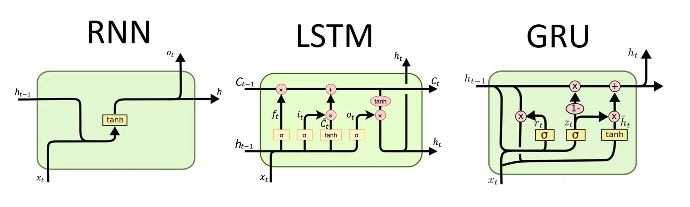
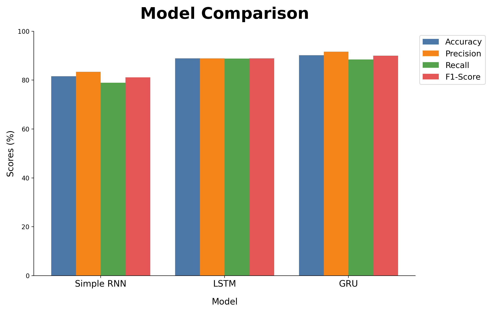
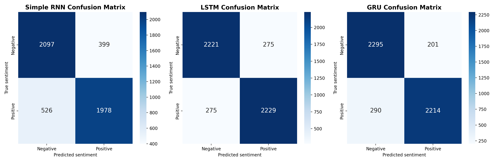
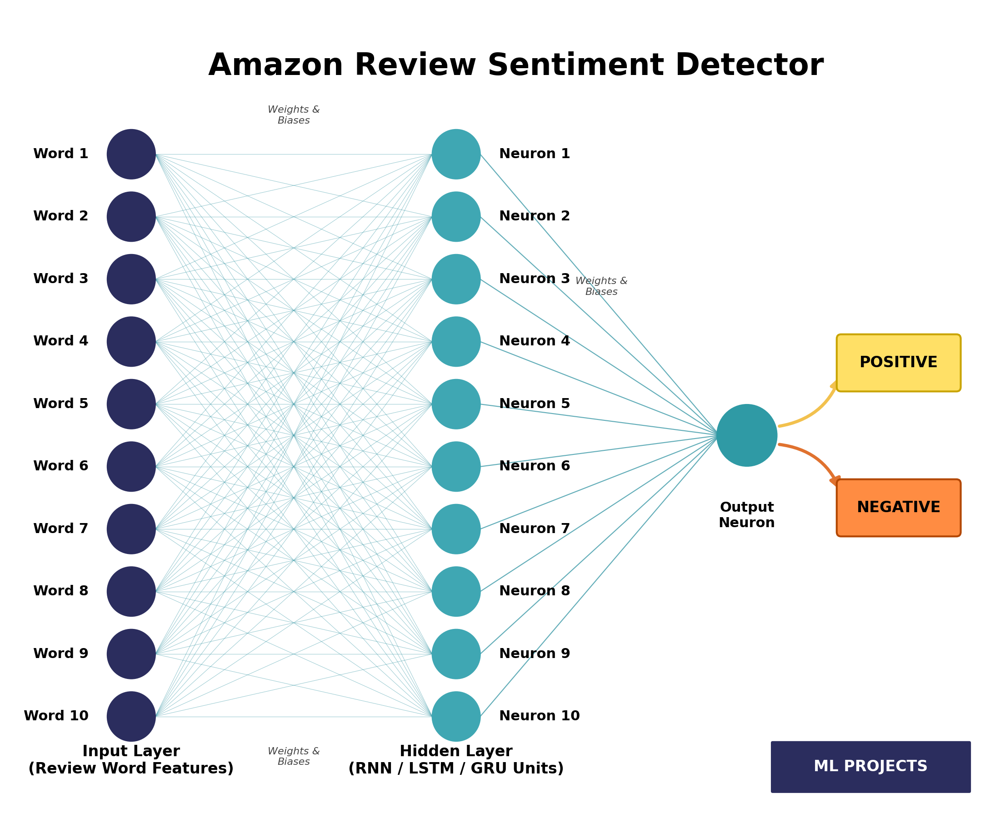

# Amazon Review Sentiment Analysis using Simple RNN, LSTM, and GRU

A comparative deep learning study that classifies Amazon customer reviews as **negative** or **positive** using three recurrent architectures: Simple RNN, LSTM, and GRU.

Under a shared preprocessing pipeline and final training setup (padding masking + EarlyStopping), **GRU** reached the highest test accuracy (**90.18%**), followed by LSTM (**88.86%**) and Simple RNN (**81.56%**).

---

## Overview

Sentiment analysis, in this project, means binary classification of review text:

- `0` → Negative
- `1` → Positive

Customer reviews are sequential text, so recurrent neural networks are a natural fit: they process tokens in order and can capture context that bag-of-words models miss.

The notebook compares three related architectures:

| Model | Role in this study |
|---|---|
| **Simple RNN** | Baseline recurrent model |
| **LSTM** | Gated recurrent model designed for longer dependencies |
| **GRU** | Gated recurrent model with a simpler structure than LSTM |

All final models use the same vocabulary, sequence length, embedding size, dropout rate, optimizer, batch size, and EarlyStopping settings so the comparison stays fair.

---

## Objectives

1. Build a binary sentiment classifier for Amazon customer reviews.
2. Train and evaluate Simple RNN, LSTM, and GRU under comparable conditions.
3. Measure the effect of padding masking (`mask_zero=True`) and EarlyStopping.
4. Compare models using accuracy, precision, recall, F1-score, confusion matrices, and parameter counts.
5. Test the trained models on manually written custom reviews.

---

## Dataset

| Item | Details |
|---|---|
| Source | [Kaggle — `bittlingmayer/amazonreviews`](https://www.kaggle.com/datasets/bittlingmayer/amazonreviews) |
| Original files | `train.ft.txt.bz2`, `test.ft.txt.bz2` (FastText-style labeled text) |
| Full training set | 3,600,000 reviews (1,800,000 positive / 1,800,000 negative) |
| Sample used here | **50,000** reviews via `df.sample(50000, random_state=42)` |
| Label mapping | `__label__1` → `0` (Negative), `__label__2` → `1` (Positive) |
| Sample class balance | 25,039 positive / 24,961 negative |

The notebook downloads both archives, but modeling uses a random sample from **`train.ft.txt.bz2` only**. That sample is then split into train / validation / test sets. The official Kaggle test file is **not** used for evaluation.

### Sample characteristics (50,000 reviews)

- No missing values
- No duplicate rows
- Review length (word count): mean ≈ 78.55, min = 13, max = 210

### Train / validation / test split

Stratified splits with `random_state=42`:

| Split | Size | Share of sample |
|---|---:|---:|
| Training | 40,000 | 80% |
| Validation | 5,000 | 10% |
| Test | 5,000 | 10% |

Procedure:

1. `train_test_split(..., test_size=0.20, stratify=y, random_state=42)`
2. Split the remaining 20% evenly into validation and test (`test_size=0.50`, stratified, `random_state=42`)

Global seed: `SEED = 42` (Python `random`, NumPy, and TensorFlow).

---

## Data Preprocessing

Steps actually applied in the notebook:

1. **Lowercasing** — `df['text'].str.lower()`
2. **HTML removal** — regex `<.*?>`
3. **Character filtering** — keep letters and spaces only (`[^a-zA-Z ]` → space)
4. **Whitespace normalization** — collapse repeated spaces and strip ends
5. **Empty-row removal** — drop empty text after cleaning (none found in this sample)

### Text vectorization

| Setting | Value |
|---|---|
| Layer | Keras `TextVectorization` |
| `max_tokens` | 20,000 |
| Output mode | Integer token IDs |
| `output_sequence_length` | 200 |
| Vocabulary fitted on | Training set only (`vectorizer.adapt(X_train)`) |

Shorter reviews are zero-padded to length 200. In the **final** models, padding is ignored via `mask_zero=True` in the Embedding layer.

---

## Model Architecture

Shared final structure:

```text
Input (200)
   → Embedding (20,000 → 128, mask_zero=True)
   → Recurrent layer (64 units)
   → Dropout (0.3)
   → Dense (1, sigmoid)
```

| Model | Recurrent layer | Total parameters |
|---|---|---:|
| Simple RNN | `SimpleRNN(64)` | 2,572,417 |
| LSTM | `LSTM(64)` | 2,609,473 |
| GRU | `GRU(64)` | 2,597,313 |

Embedding dimension is 128 for all models. The sigmoid output produces the probability of the positive class (threshold 0.5 at inference).



---

## Training Configuration

Final (masked) training setup:

| Setting | Value |
|---|---|
| Optimizer | Adam (Keras default learning rate) |
| Loss | `binary_crossentropy` |
| Metric | Accuracy |
| Batch size | 64 |
| Maximum epochs | 10 |
| EarlyStopping monitor | `val_loss` |
| Patience | 2 |
| `restore_best_weights` | `True` |
| Random seed | 42 |

EarlyStopping stops training when validation loss stops improving for two epochs and restores the weights from the best `val_loss` checkpoint.

---

## Initial vs Final Experiments

The notebook is an experimental progression, not a single final run.

### Initial / unmasked experiments

First Simple RNN and LSTM models used Embedding **without** `mask_zero=True` and trained for **5 epochs** (batch size 64):

| Model | Test accuracy | Notes |
|---|---:|---|
| Simple RNN (unmasked) | **65.58%** | Weak baseline; precision / recall / F1 ≈ 0.65 |
| LSTM (unmasked) | **50.14%** | Near chance; predicted almost all samples as Positive |

Training/validation accuracy and loss curves are plotted for these initial runs.

### Intermediate masked LSTM (no EarlyStopping)

An LSTM with `mask_zero=True` was trained for 5 epochs without EarlyStopping. Validation accuracy improved sharply (best observed ≈ **89.40%** at epoch 3), showing that padding masking was critical.

### Final / masked experiments (official comparison)

For a fair comparison, the notebook retrained:

- Simple RNN with masking + EarlyStopping
- LSTM with masking + EarlyStopping
- GRU with masking + EarlyStopping

These masked runs are the **official final results**. Do not mix the unmasked RNN/LSTM numbers with the final ranking.

---

## Model Performance

Final verified test metrics from the notebook comparison table (positive-class precision / recall / F1 via scikit-learn defaults):

| Model | Accuracy | Precision | Recall | F1-Score | Parameters |
|---|---:|---:|---:|---:|---:|
| Simple RNN | 81.56% | 83.38% | 78.91% | 81.08% | 2,572,417 |
| LSTM | 88.86% | 88.92% | 88.82% | 88.87% | 2,609,473 |
| GRU | **90.18%** | **91.68%** | **88.42%** | **90.02%** | 2,597,313 |

**Final ranking:** GRU (90.18%) > LSTM (88.86%) > Simple RNN (81.56%)

### Per-class metrics (final models)

**Simple RNN**

| Metric | Negative | Positive |
|---|---:|---:|
| Precision | 0.80 | 0.83 |
| Recall | 0.84 | 0.79 |
| F1-score | 0.82 | 0.81 |

**LSTM**

| Metric | Negative | Positive |
|---|---:|---:|
| Precision | 0.89 | 0.89 |
| Recall | 0.89 | 0.89 |
| F1-score | 0.89 | 0.89 |

**GRU**

| Metric | Negative | Positive |
|---|---:|---:|
| Precision | 0.89 | 0.92 |
| Recall | 0.92 | 0.88 |
| F1-score | 0.90 | 0.90 |



---

## Evaluation

Metrics used in the notebook:

| Metric | Purpose |
|---|---|
| **Accuracy** | Overall share of correctly classified reviews |
| **Precision** | Of predicted positives, how many were actually positive |
| **Recall** | Of actual positives, how many were found |
| **F1-score** | Harmonic mean of precision and recall |
| **Confusion matrix** | Breakdown of true/false positives and negatives |

All final scores are reported on the held-out test set of 5,000 reviews.

---

## Training and Validation Analysis

### Available plots

| Run | Training/validation curves plotted? |
|---|---|
| Initial unmasked Simple RNN | Yes |
| Initial unmasked LSTM | Yes |
| Final masked GRU | Yes |
| Final masked Simple RNN | No (training logs only) |
| Final masked LSTM | No (training logs only) |

### Final masked runs (with EarlyStopping)

**Simple RNN**

| Epoch | Train Acc | Val Acc | Val Loss |
|---:|---:|---:|---:|
| 1 | 0.7029 | 0.7224 | 0.5489 |
| 2 | 0.8177 | 0.8140 | 0.4337 |
| 3 | 0.8476 | 0.8238 | 0.4330 |
| 4 | 0.9273 | 0.8370 | 0.4569 |
| 5 | 0.9683 | 0.8286 | 0.5631 |

Stopped after epoch 5; best weights restored from epoch 3 (lowest `val_loss`). Test accuracy: **81.56%**.

**LSTM**

| Epoch | Train Acc | Val Acc | Val Loss |
|---:|---:|---:|---:|
| 1 | 0.8404 | 0.8824 | 0.2857 |
| 2 | 0.9218 | 0.9000 | 0.2704 |
| 3 | 0.9397 | 0.8870 | 0.3234 |
| 4 | 0.9558 | 0.8856 | 0.3381 |

Stopped after epoch 4; best weights restored from epoch 2. Test accuracy: **88.86%**.

**GRU**

| Epoch | Train Acc | Val Acc | Val Loss |
|---:|---:|---:|---:|
| 1 | 0.8364 | 0.8966 | 0.2671 |
| 2 | 0.9277 | 0.9050 | 0.2542 |
| 3 | 0.9579 | 0.8976 | 0.3071 |
| 4 | 0.9750 | 0.8978 | 0.3741 |

Stopped after epoch 4; best weights restored from epoch 2 (lowest `val_loss`, validation accuracy ≈ **90.50%**). Test accuracy: **90.18%**.

After epoch 2, GRU training accuracy kept rising while validation loss worsened; EarlyStopping halted further training.

---

## Confusion Matrix Analysis

Class order: **Negative (0)**, **Positive (1)**.

```text
[[TN, FP],
 [FN, TP]]
```

### Final Simple RNN

```text
[[2102, 394],
 [528, 1976]]
```

- Correct negatives: 2,102
- Correct positives: 1,976
- False positives: 394
- False negatives: 528

### Final LSTM

```text
[[2219, 277],
 [280, 2224]]
```

- Correct negatives: 2,219
- Correct positives: 2,224
- False positives: 277
- False negatives: 280

### Final GRU

```text
[[2295, 201],
 [290, 2214]]
```

- Correct negatives: 2,295
- Correct positives: 2,214
- False positives: 201
- False negatives: 290

GRU had the fewest total misclassifications among the three final models and stayed balanced across both classes.



---

## Custom Review Predictions

Five manually written reviews were passed through the final masked models (`model_rnn_masked`, `model_lstm`, `model_gru`). No ground-truth labels were assigned in the notebook.

| Review | RNN | LSTM | GRU |
|---|---|---|---|
| "This product is amazing. I really loved it!" | Positive (0.986) | Positive (0.958) | Positive (0.996) |
| "Terrible product. I regret buying it." | Negative (0.080) | Negative (0.079) | Negative (0.036) |
| "The product is okay, but nothing special." | Negative (0.093) | Negative (0.135) | Negative (0.097) |
| "Excellent quality and fast delivery." | Positive (0.984) | Positive (0.980) | Positive (0.995) |
| "Waste of money. Very disappointing." | Negative (0.002) | Negative (0.000) | Negative (0.000) |

Values in parentheses are predicted positive-class probabilities.

---

## Project Workflow

```text
Amazon Reviews
      ↓
Data Cleaning
      ↓
Text Vectorization
      ↓
Padding / Masking
      ↓
Embedding
      ↓
RNN / LSTM / GRU
      ↓
Dropout
      ↓
Sigmoid Output
      ↓
Sentiment Prediction
```



---

## Technologies Used

Verified from the notebook:

- Python
- TensorFlow / Keras
- NumPy
- Pandas
- Matplotlib
- Seaborn
- scikit-learn
- WordCloud
- bz2 / re (standard library)
- Google Colab / Jupyter Notebook
- Kaggle API (dataset download)

---

## Repository Structure

```text
Amazon Review Sentiment Analysis/
│
├── Amazon_Review_Sentiment_Analysis_using_RNN,_LSTM,_and_GRU.ipynb
├── Project Report.docx
├── Project Report.pdf
├── README.md
└── Screenshots/
    ├── concept_diagram.png
    ├── confusion_matrices.png
    ├── model_comparison.png
    └── rnn_lstm_gru_architecture.png
```

The notebook is self-contained: it downloads the dataset, cleans the text, trains the models, and reports evaluation results.

---

## How to Run

1. Open `Amazon_Review_Sentiment_Analysis_using_RNN,_LSTM,_and_GRU.ipynb` in Google Colab or Jupyter.
2. Provide Kaggle API credentials so the notebook can download `bittlingmayer/amazonreviews`.
3. Run all cells in order.
4. Review training logs, metric tables, confusion matrices, and custom prediction outputs.

Training LSTM/GRU can take a long time on CPU.

---

## Conclusion

This project compared Simple RNN, LSTM, and GRU for binary sentiment classification of Amazon reviews under the same data, preprocessing, and final training protocol.

In this experiment, GRU achieved the best test performance (**90.18%** accuracy, **90.02%** F1-score), LSTM followed at **88.86%**, and Simple RNN reached **81.56%**. Padding masking was essential: without it, the unmasked LSTM collapsed to near-chance accuracy.

These results apply to this setup and 50,000-review sample. They do not mean GRU is universally better for every sentiment task.

---

## Future Improvements

Not implemented in this project; possible next steps:

1. Broader hyperparameter tuning (units, dropout, learning rate, batch size, sequence length)
2. Pretrained embeddings (e.g., Word2Vec or GloVe)
3. Bidirectional RNN / LSTM / GRU
4. Attention mechanisms
5. Comparison with transformer-based models
6. Evaluation on additional sentiment datasets
7. Training on a larger portion of the Amazon Reviews corpus

---

## Author

Md. Masudul Hasan Akib
